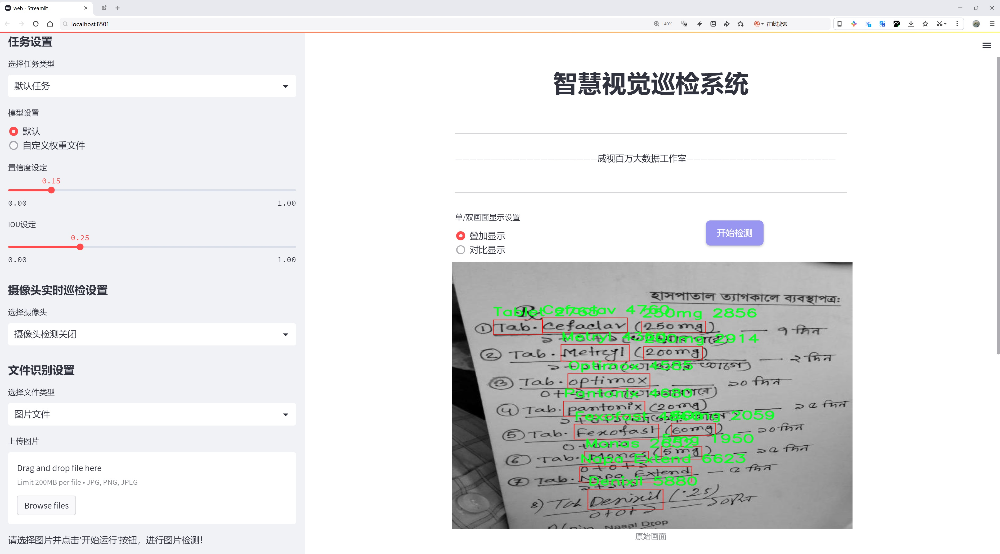

# 医生手写药品名称检测系统源码分享
 # [一条龙教学YOLOV8标注好的数据集一键训练_70+全套改进创新点发刊_Web前端展示]

### 1.研究背景与意义

项目参考[AAAI Association for the Advancement of Artificial Intelligence](https://gitee.com/qunmasj/projects)

**研究背景与意义**

在现代医疗体系中，医生手写的药品名称在处方和医疗记录中扮演着至关重要的角色。然而，由于医生的书写风格各异，手写的药品名称常常存在可读性差、歧义性高等问题，导致药品错误、用药不当等严重后果。根据相关研究，药品错误是导致患者安全事件的重要因素之一，尤其是在急救和重症监护等高风险环境中。因此，开发一种高效、准确的手写药品名称检测系统显得尤为重要。

近年来，深度学习技术的迅猛发展为图像识别和处理提供了新的解决方案。YOLO（You Only Look Once）系列模型因其高效的实时目标检测能力而广泛应用于各类视觉任务。YOLOv8作为该系列的最新版本，具备更强的特征提取能力和更快的推理速度，适合在医疗场景中处理复杂的手写药品名称识别任务。通过对YOLOv8模型的改进，可以进一步提升其在手写文字识别中的性能，特别是在处理多样化的药品名称和剂量信息时。

本研究基于改进的YOLOv8模型，构建一个医生手写药品名称检测系统，旨在实现对手写药品名称的自动识别和分类。我们使用的数据集包含3023张图像，涵盖1935个类别的药品名称，包括常见的抗生素、镇痛药、抗病毒药物等。该数据集的多样性和丰富性为模型的训练提供了坚实的基础，能够有效提高系统的识别准确率和鲁棒性。

研究的意义不仅在于提升药品名称的识别精度，更在于通过自动化手段减少人为错误，提高医疗安全性。该系统的应用将有助于医务人员在开具处方时，快速、准确地识别药品名称，降低因书写不清导致的用药错误风险。此外，系统的实现还可以为医院的信息化建设提供支持，推动智能医疗的发展。

综上所述，基于改进YOLOv8的医生手写药品名称检测系统的研究具有重要的理论价值和实际意义。它不仅能够为手写药品名称的自动识别提供有效的解决方案，还将为提升医疗服务质量、保障患者安全做出积极贡献。通过本研究，我们期望能够为未来的医疗智能化提供借鉴，推动人工智能技术在医疗领域的深入应用。

### 2.图片演示




##### 注意：由于此博客编辑较早，上面“2.图片演示”和“3.视频演示”展示的系统图片或者视频可能为老版本，新版本在老版本的基础上升级如下：（实际效果以升级的新版本为准）

  （1）适配了YOLOV8的“目标检测”模型和“实例分割”模型，通过加载相应的权重（.pt）文件即可自适应加载模型。

  （2）支持“图片识别”、“视频识别”、“摄像头实时识别”三种识别模式。

  （3）支持“图片识别”、“视频识别”、“摄像头实时识别”三种识别结果保存导出，解决手动导出（容易卡顿出现爆内存）存在的问题，识别完自动保存结果并导出到。

  （4）支持Web前端系统中的标题、背景图等自定义修改，后面提供修改教程。

  另外本项目提供训练的数据集和训练教程,暂不提供权重文件（best.pt）,需要您按照教程进行训练后实现图片演示和Web前端界面演示的效果。

### 3.视频演示

[3.1 视频演示](https://www.bilibili.com/video/BV1c6WmesEZU/?vd_source=bc9aec86d164b67a7004b996143742dc)

### 4.数据集信息展示

数据集信息展示

本数据集名为“Drug names 2”，专门用于训练改进YOLOv8的医生手写药品名称检测系统。该数据集包含3023张图像，涵盖了1935个类别，展示了丰富的药品名称和相关信息。这些图像经过精心挑选，确保能够有效支持模型在手写药品名称识别任务中的学习与优化。

数据集中包含的类别涵盖了多种药品，包括常见的抗生素、镇痛药、抗高血压药物、抗抑郁药物等，具体药品名称如苄青霉素、阿莫西林、阿莫西林克拉维酸、氨氯地平等。这些药品名称不仅包括了药品的通用名称，还涵盖了不同剂量、不同形式的药品描述，如“0.5mg”、“1 cap”、“10mg”等，极大地丰富了数据集的多样性和复杂性。

在药品类别的分类中，数据集细致地列出了药品的不同剂量和形式，这对于训练模型识别手写药品名称时的准确性至关重要。例如，数据集中不仅有“阿莫西林”这一药品名称，还包括了“阿莫西林 500mg”、“阿莫西林 1g”等多种剂量形式。这种多样化的分类方式，使得模型能够学习到不同药品名称在手写时的多种表现形式，从而提高其识别的准确性和鲁棒性。

此外，数据集中的药品名称还包括了许多常见的非处方药和处方药，这些药品在临床实践中经常被医生手写开具。通过对这些药品名称的学习，模型能够更好地适应实际应用场景，提升其在医疗环境中的实用性。例如，数据集中包含了“布洛芬”、“对乙酰氨基酚”等常用药物，这些药物的识别对于医生在快速开具处方时尤为重要。

为了确保数据集的高质量和实用性，所有图像均经过严格的标注和审核，确保每个药品名称的准确性和清晰度。这一过程不仅提高了数据集的可信度，也为后续的模型训练提供了坚实的基础。数据集的使用遵循CC BY 4.0许可证，允许用户在遵循相关规定的前提下自由使用和分享。

综上所述，“Drug names 2”数据集为训练改进YOLOv8的医生手写药品名称检测系统提供了丰富的资源，涵盖了多种药品名称及其剂量形式，确保了数据的多样性和复杂性。通过对该数据集的有效利用，模型能够在实际应用中更好地识别和处理医生手写的药品名称，从而提升医疗服务的效率和准确性。


### 5.全套项目环境部署视频教程（零基础手把手教学）

[5.1 环境部署教程链接（零基础手把手教学）](https://www.ixigua.com/7404473917358506534?logTag=c807d0cbc21c0ef59de5)


[5.2 安装Python虚拟环境创建和依赖库安装视频教程链接（零基础手把手教学）](https://www.ixigua.com/7404474678003106304?logTag=1f1041108cd1f708b01a)

### 6.手把手YOLOV8训练视频教程（零基础小白有手就能学会）

[6.1 环境部署教程链接（零基础手把手教学）](https://www.ixigua.com/7404477157818401292?logTag=d31a2dfd1983c9668658)

### 7.70+种全套YOLOV8创新点代码加载调参视频教程（一键加载写好的改进模型的配置文件）

[7.1 环境部署教程链接（零基础手把手教学）](https://www.ixigua.com/7404478314661806627?logTag=29066f8288e3f4eea3a4)

### 8.70+种全套YOLOV8创新点原理讲解（非科班也可以轻松写刊发刊，V10版本正在科研待更新）

由于篇幅限制，每个创新点的具体原理讲解就不一一展开，具体见下列网址中的创新点对应子项目的技术原理博客网址【Blog】：


[8.1 70+种全套YOLOV8创新点原理讲解链接](https://gitee.com/qunmasj/good)

### 9.系统功能展示（检测对象为举例，实际内容以本项目数据集为准）

图1.系统支持检测结果表格显示

  图2.系统支持置信度和IOU阈值手动调节

  图3.系统支持自定义加载权重文件best.pt(需要你通过步骤5中训练获得)

  图4.系统支持摄像头实时识别

  图5.系统支持图片识别

  图6.系统支持视频识别

  图7.系统支持识别结果文件自动保存

  图8.系统支持Excel导出检测结果数据


### 10.原始YOLOV8算法原理

原始YOLOv8算法原理

YOLOv8算法作为YOLO系列的最新版本，继承并优化了前几代算法的核心思想与结构，旨在实现更高效的目标检测。该算法的设计理念是通过将整个图像作为输入，直接在图像上进行目标检测和定位，从而避免了传统方法中滑动窗口或区域提议的复杂性。YOLOv8的网络结构由输入层、主干网络、特征融合层和解耦头组成，这一架构使得算法在精度和速度上均有显著提升。

在主干网络方面，YOLOv8采用了CSPDarknet作为基础架构，并在此基础上引入了C2f模块，取代了YOLOv5中的C3模块。C2f模块的设计灵感来源于YOLOv7的ELAN思想，旨在通过引入更多的shortcut连接来缓解深层网络中的梯度消失问题，同时增强浅层特征的重用。C2f模块由多个CBS（卷积+归一化+SiLU激活函数）模块和若干个Bottleneck组成，通过对特征图的多次处理，能够提取出更加丰富的特征信息。这种结构不仅保持了输入输出特征图的尺寸一致性，还通过优化梯度流动路径，提升了模型的收敛速度和精度。

特征融合层采用了PAN-FPN结构，旨在实现多尺度特征的有效融合。该结构通过自下而上的方式将高层特征与中层、浅层特征进行融合，确保了不同层次的特征信息能够被充分利用。YOLOv8在这一过程中去除了YOLOv5中的某些冗余操作，直接将高层特征进行上采样并与中层特征进行连接，从而提升了特征融合的效率。通过这种方式，YOLOv8能够在不同分辨率下有效检测目标，确保每一层特征图都包含丰富的语义信息。

在解耦头部分，YOLOv8引入了Anchor-Free的思想，抛弃了传统的Anchor-Base方法。这一变化使得目标检测过程更加灵活，并且能够有效应对小目标的检测问题。解耦头的设计借鉴了YOLOX和YOLOv6的思路，取消了objectness分支，简化了网络结构。YOLOv8的Head部分输出三个不同尺度的特征图，分别为80x80、40x40和20x20，通过对特征图的维度变换，实现了分类和边框回归的解耦。这种解耦设计不仅提高了检测精度，还加快了模型的推理速度。

在损失函数的设计上，YOLOv8采用了VFLLoss作为分类损失，并结合DFLLoss和CIoULoss来优化边框回归。这种组合损失函数能够有效应对样本不平衡问题，特别是在处理小目标时，能够显著提升模型的学习效果。此外，YOLOv8还引入了Task-Aligned的样本匹配策略，进一步提升了训练过程中的样本利用效率。

数据预处理方面，YOLOv8延续了YOLOv5的策略，采用了多种数据增强手段，如马赛克增强、混合增强、空间扰动和颜色扰动等。这些增强手段能够有效提升模型的鲁棒性，使其在各种复杂场景下依然能够保持良好的检测性能。

总的来说，YOLOv8在目标检测领域展现出了卓越的性能。通过引入更深的卷积神经网络结构和多种创新技术，YOLOv8不仅在精度上实现了显著提升，还在处理速度上也有了质的飞跃。与前代算法相比，YOLOv8在精度和帧率上均表现出色，能够广泛应用于智能监控、自动驾驶、人脸识别等多个领域。其设计理念和技术创新为未来的目标检测研究提供了新的思路和方向，标志着YOLO系列算法的又一次重要进步。


### 11.项目核心源码讲解（再也不用担心看不懂代码逻辑）

#### 11.1 ultralytics\engine\predictor.py

以下是对给定代码的核心部分进行提炼和详细注释的结果：

```python
import cv2
import numpy as np
import torch
from ultralytics.cfg import get_cfg, get_save_dir
from ultralytics.data import load_inference_source
from ultralytics.nn.autobackend import AutoBackend
from ultralytics.utils import LOGGER, select_device, smart_inference_mode

class BasePredictor:
    """
    BasePredictor类用于创建YOLO模型的预测器。
    该类负责模型的初始化、图像预处理、推理、后处理以及结果的保存和展示。
    """

    def __init__(self, cfg='default_cfg.yaml', overrides=None):
        """
        初始化BasePredictor类。

        Args:
            cfg (str): 配置文件路径，默认为'default_cfg.yaml'。
            overrides (dict): 配置覆盖，默认为None。
        """
        self.args = get_cfg(cfg, overrides)  # 获取配置
        self.save_dir = get_save_dir(self.args)  # 获取保存结果的目录
        self.model = None  # 模型初始化为None
        self.device = None  # 设备初始化为None
        self.results = None  # 结果初始化为None

    def preprocess(self, im):
        """
        对输入图像进行预处理。

        Args:
            im (torch.Tensor | List(np.ndarray)): 输入图像，支持Tensor或NumPy数组列表。

        Returns:
            torch.Tensor: 预处理后的图像张量。
        """
        im = torch.from_numpy(im).to(self.device)  # 转换为Tensor并移动到指定设备
        im = im.float() / 255.0  # 归一化到[0, 1]
        return im

    def inference(self, im):
        """
        使用模型对输入图像进行推理。

        Args:
            im (torch.Tensor): 预处理后的图像张量。

        Returns:
            torch.Tensor: 推理结果。
        """
        return self.model(im)  # 调用模型进行推理

    def postprocess(self, preds):
        """
        对推理结果进行后处理。

        Args:
            preds (torch.Tensor): 模型的推理结果。

        Returns:
            list: 后处理后的结果列表。
        """
        return preds.tolist()  # 将结果转换为列表

    @smart_inference_mode()
    def predict(self, source):
        """
        对给定源进行推理。

        Args:
            source (str): 输入源，可以是图像、视频或流。

        Returns:
            list: 推理结果列表。
        """
        self.model = AutoBackend(self.args.model, device=select_device(self.args.device))  # 初始化模型
        self.device = self.model.device  # 更新设备
        dataset = load_inference_source(source)  # 加载输入源

        results = []
        for batch in dataset:  # 遍历数据集
            im = self.preprocess(batch)  # 预处理
            preds = self.inference(im)  # 推理
            results.append(self.postprocess(preds))  # 后处理并保存结果

        return results  # 返回所有结果
```

### 代码分析与注释

1. **导入必要的库**：
   - `cv2`：用于图像处理和视频操作。
   - `numpy`：用于数值计算。
   - `torch`：用于深度学习模型的推理。
   - `ultralytics`模块：提供YOLO模型的配置、数据加载和模型后端支持。

2. **BasePredictor类**：
   - 该类是YOLO模型预测的基础类，负责模型的初始化、图像的预处理、推理和后处理。

3. **初始化方法**：
   - `__init__`方法中，使用`get_cfg`函数获取配置，设置保存目录，并初始化模型和设备。

4. **预处理方法**：
   - `preprocess`方法将输入图像转换为Tensor，并归一化到[0, 1]范围。

5. **推理方法**：
   - `inference`方法调用模型进行推理，返回推理结果。

6. **后处理方法**：
   - `postprocess`方法将推理结果转换为列表，便于后续处理。

7. **预测方法**：
   - `predict`方法是主入口，负责加载模型、处理输入源、进行推理并返回结果。

以上是对代码的核心部分进行了提炼和详细注释，旨在帮助理解YOLO模型的预测流程。

这个文件是Ultralytics YOLO（You Only Look Once）目标检测模型的预测模块，主要用于在图像、视频、网络摄像头等多种来源上进行推理。文件中包含了类`BasePredictor`，该类是创建预测器的基础类，提供了进行推理所需的各种功能和方法。

在文件开头，使用了多行字符串注释来描述如何使用该模块，包括支持的输入源（如摄像头、图像、视频、目录、YouTube链接等）和模型格式（如PyTorch、ONNX、TensorRT等）。这为用户提供了使用该模块的基本指导。

`BasePredictor`类的构造函数`__init__`初始化了一些基本属性，包括配置参数、保存结果的目录、模型、数据、设备等。它还会检查是否需要显示图像，并设置一些用于线程安全的锁。

类中定义了多个方法，其中`preprocess`方法用于对输入图像进行预处理，将图像转换为模型所需的格式。`inference`方法则负责执行推理，使用指定的模型对预处理后的图像进行处理。`postprocess`方法用于对模型的输出进行后处理。

`__call__`方法允许用户直接调用`BasePredictor`实例进行推理。`predict_cli`方法则用于命令行界面的推理，确保输出为生成器形式。

`setup_source`方法用于设置输入源和推理模式，确保输入图像的大小符合模型要求。`stream_inference`方法则实现了实时推理的功能，能够处理视频流并保存结果。

在推理过程中，`write_results`方法负责将推理结果写入文件或目录，包括保存检测到的边界框、分类结果等。`show`方法用于在窗口中显示图像，`save_preds`方法则将推理结果保存为视频文件。

`run_callbacks`和`add_callback`方法用于管理回调函数，允许用户在特定事件发生时执行自定义的操作。

总的来说，这个文件提供了一个灵活且功能强大的框架，用于在多种输入源上进行目标检测推理，支持多种模型格式，并能够处理实时视频流。通过合理配置和调用，用户可以方便地使用YOLO模型进行目标检测任务。

#### 11.2 ui.py

```python
import sys
import subprocess

def run_script(script_path):
    """
    使用当前 Python 环境运行指定的脚本。

    Args:
        script_path (str): 要运行的脚本路径

    Returns:
        None
    """
    # 获取当前 Python 解释器的路径
    python_path = sys.executable

    # 构建运行命令
    command = f'"{python_path}" -m streamlit run "{script_path}"'

    # 执行命令
    result = subprocess.run(command, shell=True)
    if result.returncode != 0:
        print("脚本运行出错。")


# 实例化并运行应用
if __name__ == "__main__":
    # 指定您的脚本路径
    script_path = "web.py"  # 这里直接指定脚本路径

    # 运行脚本
    run_script(script_path)  # 调用函数执行脚本
```

### 代码注释说明：

1. **导入模块**：
   - `import sys`：导入 sys 模块，用于访问与 Python 解释器相关的变量和函数。
   - `import subprocess`：导入 subprocess 模块，用于执行外部命令。

2. **定义函数 `run_script`**：
   - 函数接受一个参数 `script_path`，表示要运行的 Python 脚本的路径。
   - 使用 `sys.executable` 获取当前 Python 解释器的路径，以确保使用正确的 Python 环境。

3. **构建命令**：
   - 使用 f-string 格式化字符串，构建运行命令，命令形式为 `python -m streamlit run script_path`，用于运行 Streamlit 应用。

4. **执行命令**：
   - 使用 `subprocess.run` 执行构建的命令，并通过 `shell=True` 允许在 shell 中执行。
   - 检查命令的返回码，如果不为 0，表示执行出错，打印错误信息。

5. **主程序入口**：
   - 使用 `if __name__ == "__main__":` 确保只有在直接运行该脚本时才会执行以下代码。
   - 指定要运行的脚本路径为 `web.py`。
   - 调用 `run_script` 函数来执行指定的脚本。

这个程序文件名为 `ui.py`，其主要功能是通过当前的 Python 环境来运行一个指定的脚本，具体是使用 Streamlit 框架来启动一个 Web 应用。

程序首先导入了必要的模块，包括 `sys`、`os` 和 `subprocess`，这些模块分别用于访问 Python 解释器的相关信息、处理文件路径和执行外部命令。此外，还导入了 `abs_path` 函数，这个函数来自于 `QtFusion.path` 模块，主要用于获取文件的绝对路径。

在 `run_script` 函数中，首先定义了一个参数 `script_path`，用于接收要运行的脚本的路径。函数内部通过 `sys.executable` 获取当前 Python 解释器的路径，然后构建一个命令字符串，这个命令用于运行指定的脚本。具体的命令格式是 `python -m streamlit run script_path`，这表示使用 Streamlit 来运行指定的 Python 脚本。

接下来，使用 `subprocess.run` 方法来执行构建好的命令。如果命令执行的返回码不为零，表示脚本运行过程中出现了错误，此时会打印出“脚本运行出错”的提示信息。

在文件的最后部分，使用 `if __name__ == "__main__":` 语句来确保只有在直接运行该脚本时才会执行以下代码。这里指定了要运行的脚本路径 `script_path`，通过调用 `abs_path` 函数获取 `web.py` 的绝对路径。最后，调用 `run_script` 函数来执行这个脚本。

总体来说，这个程序的作用是为用户提供一个简单的接口，以便在当前 Python 环境中运行一个 Streamlit 应用脚本。

#### 11.3 ultralytics\trackers\utils\gmc.py

以下是代码中最核心的部分，并附上详细的中文注释：

```python
import cv2
import numpy as np

class GMC:
    """
    一般化运动补偿 (GMC) 类，用于视频帧中的跟踪和物体检测。

    属性:
        method (str): 用于跟踪的方法，包括 'orb', 'sift', 'ecc', 'sparseOptFlow', 'none'。
        downscale (int): 处理帧时的缩放因子。
        prevFrame (np.array): 存储用于跟踪的前一帧。
        prevKeyPoints (list): 存储前一帧的关键点。
        prevDescriptors (np.array): 存储前一帧的描述符。
        initializedFirstFrame (bool): 标志位，指示是否已处理第一帧。
    """

    def __init__(self, method: str = "sparseOptFlow", downscale: int = 2) -> None:
        """
        初始化视频跟踪器，指定方法和缩放因子。

        参数:
            method (str): 用于跟踪的方法。
            downscale (int): 处理帧的缩放因子。
        """
        self.method = method
        self.downscale = max(1, int(downscale))

        # 根据选择的方法初始化检测器、提取器和匹配器
        if self.method == "orb":
            self.detector = cv2.FastFeatureDetector_create(20)
            self.extractor = cv2.ORB_create()
            self.matcher = cv2.BFMatcher(cv2.NORM_HAMMING)
        elif self.method == "sift":
            self.detector = cv2.SIFT_create(nOctaveLayers=3, contrastThreshold=0.02, edgeThreshold=20)
            self.extractor = cv2.SIFT_create(nOctaveLayers=3, contrastThreshold=0.02, edgeThreshold=20)
            self.matcher = cv2.BFMatcher(cv2.NORM_L2)
        elif self.method == "ecc":
            self.warp_mode = cv2.MOTION_EUCLIDEAN
            self.criteria = (cv2.TERM_CRITERIA_EPS | cv2.TERM_CRITERIA_COUNT, 5000, 1e-6)
        elif self.method == "sparseOptFlow":
            self.feature_params = dict(maxCorners=1000, qualityLevel=0.01, minDistance=1, blockSize=3)
        elif self.method in {"none", "None", None}:
            self.method = None
        else:
            raise ValueError(f"错误: 未知的 GMC 方法: {method}")

        # 初始化存储变量
        self.prevFrame = None
        self.prevKeyPoints = None
        self.prevDescriptors = None
        self.initializedFirstFrame = False

    def apply(self, raw_frame: np.array) -> np.array:
        """
        使用指定的方法对原始帧进行物体检测。

        参数:
            raw_frame (np.array): 要处理的原始帧。

        返回:
            (np.array): 处理后的帧。
        """
        if self.method in ["orb", "sift"]:
            return self.applyFeatures(raw_frame)
        elif self.method == "ecc":
            return self.applyEcc(raw_frame)
        elif self.method == "sparseOptFlow":
            return self.applySparseOptFlow(raw_frame)
        else:
            return np.eye(2, 3)

    def applyEcc(self, raw_frame: np.array) -> np.array:
        """
        对原始帧应用 ECC 算法。

        参数:
            raw_frame (np.array): 要处理的原始帧。

        返回:
            (np.array): 处理后的帧。
        """
        height, width, _ = raw_frame.shape
        frame = cv2.cvtColor(raw_frame, cv2.COLOR_BGR2GRAY)  # 转换为灰度图
        H = np.eye(2, 3, dtype=np.float32)  # 初始化变换矩阵

        # 根据缩放因子对图像进行下采样
        if self.downscale > 1.0:
            frame = cv2.GaussianBlur(frame, (3, 3), 1.5)
            frame = cv2.resize(frame, (width // self.downscale, height // self.downscale))
            width = width // self.downscale
            height = height // self.downscale

        # 处理第一帧
        if not self.initializedFirstFrame:
            self.prevFrame = frame.copy()  # 复制当前帧
            self.initializedFirstFrame = True  # 标记第一帧已初始化
            return H

        # 运行 ECC 算法，计算变换矩阵
        try:
            (cc, H) = cv2.findTransformECC(self.prevFrame, frame, H, self.warp_mode, self.criteria, None, 1)
        except Exception as e:
            LOGGER.warning(f"警告: 变换计算失败，使用单位矩阵 {e}")

        return H

    def applyFeatures(self, raw_frame: np.array) -> np.array:
        """
        对原始帧应用基于特征的方法（如 ORB 或 SIFT）。

        参数:
            raw_frame (np.array): 要处理的原始帧。

        返回:
            (np.array): 处理后的帧。
        """
        height, width, _ = raw_frame.shape
        frame = cv2.cvtColor(raw_frame, cv2.COLOR_BGR2GRAY)  # 转换为灰度图
        H = np.eye(2, 3)  # 初始化变换矩阵

        # 根据缩放因子对图像进行下采样
        if self.downscale > 1.0:
            frame = cv2.resize(frame, (width // self.downscale, height // self.downscale))
            width = width // self.downscale
            height = height // self.downscale

        # 查找关键点
        keypoints = self.detector.detect(frame, None)

        # 处理第一帧
        if not self.initializedFirstFrame:
            self.prevFrame = frame.copy()
            self.prevKeyPoints = copy.copy(keypoints)
            self.initializedFirstFrame = True
            return H

        # 计算描述符
        keypoints, descriptors = self.extractor.compute(frame, keypoints)

        # 匹配描述符
        knnMatches = self.matcher.knnMatch(self.prevDescriptors, descriptors, 2)

        # 过滤匹配
        matches = []
        for m, n in knnMatches:
            if m.distance < 0.9 * n.distance:
                matches.append(m)

        # 找到刚性变换矩阵
        if len(matches) > 4:
            prevPoints = np.array([self.prevKeyPoints[m.queryIdx].pt for m in matches])
            currPoints = np.array([keypoints[m.trainIdx].pt for m in matches])
            H, _ = cv2.estimateAffinePartial2D(prevPoints, currPoints, cv2.RANSAC)

        self.prevFrame = frame.copy()
        self.prevKeyPoints = copy.copy(keypoints)

        return H

    def applySparseOptFlow(self, raw_frame: np.array) -> np.array:
        """
        对原始帧应用稀疏光流方法。

        参数:
            raw_frame (np.array): 要处理的原始帧。

        返回:
            (np.array): 处理后的帧。
        """
        height, width, _ = raw_frame.shape
        frame = cv2.cvtColor(raw_frame, cv2.COLOR_BGR2GRAY)  # 转换为灰度图
        H = np.eye(2, 3)  # 初始化变换矩阵

        # 根据缩放因子对图像进行下采样
        if self.downscale > 1.0:
            frame = cv2.resize(frame, (width // self.downscale, height // self.downscale))

        # 查找关键点
        keypoints = cv2.goodFeaturesToTrack(frame, mask=None, **self.feature_params)

        # 处理第一帧
        if not self.initializedFirstFrame:
            self.prevFrame = frame.copy()
            self.prevKeyPoints = copy.copy(keypoints)
            self.initializedFirstFrame = True
            return H

        # 计算光流
        matchedKeypoints, status, _ = cv2.calcOpticalFlowPyrLK(self.prevFrame, frame, self.prevKeyPoints, None)

        # 仅保留好的匹配点
        prevPoints = []
        currPoints = []
        for i in range(len(status)):
            if status[i]:
                prevPoints.append(self.prevKeyPoints[i])
                currPoints.append(matchedKeypoints[i])

        prevPoints = np.array(prevPoints)
        currPoints = np.array(currPoints)

        # 找到刚性变换矩阵
        if len(prevPoints) > 4:
            H, _ = cv2.estimateAffinePartial2D(prevPoints, currPoints, cv2.RANSAC)

        self.prevFrame = frame.copy()
        self.prevKeyPoints = copy.copy(keypoints)

        return H
```

### 代码说明：
1. **类 GMC**：用于实现运动补偿和物体跟踪的主要类，支持多种跟踪算法。
2. **初始化方法 `__init__`**：根据选择的跟踪方法初始化相应的检测器、提取器和匹配器，并设置缩放因子。
3. **`apply` 方法**：根据选择的跟踪方法对输入的原始帧进行处理。
4. **`applyEcc` 方法**：实现了基于增强相关性（ECC）算法的帧处理。
5. **`applyFeatures` 方法**：实现了基于特征（如 ORB 或 SIFT）的帧处理，计算关键点和描述符，并进行匹配。
6. **`applySparseOptFlow` 方法**：实现了稀疏光流方法的帧处理，计算光流并匹配关键点。

通过这些方法，GMC 类能够有效地跟踪视频中的物体，并进行运动补偿。

这个程序文件定义了一个名为 `GMC` 的类，主要用于视频帧中的目标跟踪和检测。该类实现了多种跟踪算法，包括 ORB、SIFT、ECC 和稀疏光流，并支持对帧进行下采样以提高计算效率。

在 `GMC` 类的构造函数中，用户可以指定跟踪方法和下采样因子。支持的跟踪方法包括 'orb'、'sift'、'ecc'、'sparseOptFlow' 和 'none'。根据选择的跟踪方法，程序会初始化相应的特征检测器、描述符提取器和匹配器。例如，使用 ORB 方法时，会创建一个 FAST 特征检测器和 ORB 描述符提取器；而使用 SIFT 方法时，则会创建 SIFT 特征检测器和描述符提取器。

类中有多个方法用于处理输入的原始帧。`apply` 方法根据指定的跟踪方法调用相应的处理函数。对于特征基础的方法（如 ORB 和 SIFT），调用 `applyFeatures` 方法；对于 ECC 方法，调用 `applyEcc`；对于稀疏光流方法，调用 `applySparseOptFlow`。

`applyEcc` 方法实现了 ECC 算法。它首先将输入帧转换为灰度图像，并根据下采样因子对图像进行处理。若是处理第一帧，则会初始化相关数据；否则，调用 OpenCV 的 `findTransformECC` 函数来计算变换矩阵。

`applyFeatures` 方法则使用特征检测和描述符匹配来处理帧。它会检测关键点并计算描述符，然后通过 KNN 匹配器进行匹配。匹配完成后，程序会根据空间距离过滤匹配结果，并计算出刚性变换矩阵。

`applySparseOptFlow` 方法实现了稀疏光流算法。它同样将输入帧转换为灰度图像，检测关键点，并通过光流法找到关键点之间的对应关系。最后，计算出变换矩阵。

此外，类中还提供了 `reset_params` 方法，用于重置类的参数，便于在不同场景下重新初始化跟踪器。

整体而言，这个类提供了一种灵活的方式来处理视频帧中的目标跟踪，用户可以根据需求选择不同的跟踪算法和参数设置。

#### 11.4 ultralytics\hub\utils.py

以下是代码中最核心的部分，并附上详细的中文注释：

```python
import requests
import threading
import time
from ultralytics.utils import (
    LOGGER,
    SETTINGS,
    ENVIRONMENT,
    __version__,
)

# 定义一个函数，用于发送带有进度条的HTTP请求
def requests_with_progress(method, url, **kwargs):
    """
    使用指定的方法和URL发送HTTP请求，并可选地显示进度条。

    参数:
        method (str): 要使用的HTTP方法（例如 'GET', 'POST'）。
        url (str): 要发送请求的URL。
        **kwargs (dict): 传递给底层 `requests.request` 函数的其他关键字参数。

    返回:
        (requests.Response): HTTP请求的响应对象。
    """
    progress = kwargs.pop("progress", False)  # 从kwargs中获取进度参数
    if not progress:
        return requests.request(method, url, **kwargs)  # 如果没有进度条，直接发送请求

    # 如果需要显示进度条
    response = requests.request(method, url, stream=True, **kwargs)  # 以流的方式发送请求
    total = int(response.headers.get("content-length", 0))  # 获取响应的总大小
    try:
        pbar = TQDM(total=total, unit="B", unit_scale=True, unit_divisor=1024)  # 初始化进度条
        for data in response.iter_content(chunk_size=1024):  # 按块读取响应内容
            pbar.update(len(data))  # 更新进度条
        pbar.close()  # 关闭进度条
    except requests.exceptions.ChunkedEncodingError:  # 处理连接中断的异常
        response.close()  # 关闭响应
    return response  # 返回响应对象


# 定义一个函数，用于智能请求，带有重试机制
def smart_request(method, url, retry=3, timeout=30, thread=True, verbose=True, progress=False, **kwargs):
    """
    使用'requests'库发送HTTP请求，带有指数退避重试机制。

    参数:
        method (str): 请求使用的HTTP方法。
        url (str): 要发送请求的URL。
        retry (int, optional): 放弃之前尝试的重试次数。默认是3。
        timeout (int, optional): 超时时间（秒），超过此时间将放弃重试。默认是30。
        thread (bool, optional): 是否在单独的守护线程中执行请求。默认是True。
        verbose (bool, optional): 是否在控制台打印输出。默认是True。
        progress (bool, optional): 是否在请求期间显示进度条。默认是False。
        **kwargs (dict): 传递给指定方法的请求函数的关键字参数。

    返回:
        (requests.Response): HTTP响应对象。如果请求在单独线程中执行，则返回None。
    """
    retry_codes = (408, 500)  # 仅对这些状态码进行重试

    @TryExcept(verbose=verbose)  # 包装函数以处理异常
    def func(func_method, func_url, **func_kwargs):
        """执行带有重试和超时的HTTP请求，支持进度跟踪。"""
        r = None  # 响应对象
        t0 = time.time()  # 记录开始时间
        for i in range(retry + 1):
            if (time.time() - t0) > timeout:  # 检查是否超时
                break
            r = requests_with_progress(func_method, func_url, **func_kwargs)  # 发送请求
            if r.status_code < 300:  # 如果状态码在2xx范围内，表示成功
                break
            # 处理错误信息
            if i == 0 and r.status_code in retry_codes:
                LOGGER.warning(f"请求失败，正在重试 {retry} 次。状态码: {r.status_code}")
            time.sleep(2**i)  # 指数退避
        return r  # 返回响应对象

    args = method, url
    kwargs["progress"] = progress  # 添加进度参数
    if thread:
        threading.Thread(target=func, args=args, kwargs=kwargs, daemon=True).start()  # 在新线程中执行
    else:
        return func(*args, **kwargs)  # 在当前线程中执行


# 事件类，用于收集匿名事件分析
class Events:
    """
    收集匿名事件分析的类。事件分析在设置中sync=True时启用，sync=False时禁用。

    属性:
        url (str): 发送匿名事件的URL。
        rate_limit (float): 发送事件的速率限制（秒）。
        metadata (dict): 包含环境元数据的字典。
        enabled (bool): 根据某些条件启用或禁用事件。
    """

    url = "https://www.google-analytics.com/mp/collect?measurement_id=G-X8NCJYTQXM&api_secret=QLQrATrNSwGRFRLE-cbHJw"

    def __init__(self):
        """初始化事件对象，设置默认值。"""
        self.events = []  # 事件列表
        self.rate_limit = 60.0  # 速率限制（秒）
        self.t = 0.0  # 速率限制计时器（秒）
        self.metadata = {
            "version": __version__,  # 版本信息
            "env": ENVIRONMENT,  # 环境信息
        }
        self.enabled = SETTINGS["sync"]  # 根据设置决定是否启用事件

    def __call__(self, cfg):
        """
        尝试将新事件添加到事件列表，并在达到速率限制时发送事件。

        参数:
            cfg (IterableSimpleNamespace): 包含模式和任务信息的配置对象。
        """
        if not self.enabled:
            return  # 如果事件禁用，直接返回

        # 添加事件到列表
        if len(self.events) < 25:  # 限制事件列表最多25个事件
            self.events.append({"name": cfg.mode, "params": self.metadata})

        # 检查速率限制
        t = time.time()
        if (t - self.t) < self.rate_limit:
            return  # 如果在速率限制内，等待发送

        # 超过速率限制，发送事件
        data = {"client_id": SETTINGS["uuid"], "events": self.events}  # 包含事件的请求数据
        smart_request("post", self.url, json=data, retry=0, verbose=False)  # 发送POST请求

        # 重置事件和速率限制计时器
        self.events = []
        self.t = t


# 初始化事件对象
events = Events()
```

### 代码核心部分说明：
1. **requests_with_progress**: 该函数用于发送HTTP请求，并在下载过程中显示进度条。它处理了响应的流式读取和进度更新。
2. **smart_request**: 该函数提供了一个智能的HTTP请求方法，支持重试机制和超时控制。它可以在新线程中执行请求，并在请求失败时进行重试。
3. **Events类**: 该类用于收集和发送匿名事件分析。它包含事件的元数据，并在满足条件时将事件发送到指定的URL。

这个程序文件 `ultralytics/hub/utils.py` 是 Ultralytics YOLO 项目的一部分，主要用于处理与 Ultralytics Hub 相关的功能，包括网络请求、事件分析和进度条显示等。

首先，文件导入了一些必要的库和模块，包括操作系统、平台、随机数、线程、时间等基础库，以及一些来自 `ultralytics.utils` 的工具函数和常量。这些导入的工具函数提供了环境检测、日志记录、版本信息等功能。

接下来，程序定义了两个主要的网络请求函数。第一个是 `request_with_credentials`，该函数用于在 Google Colab 环境中进行 AJAX 请求。它会检查当前环境是否为 Colab，如果不是，则抛出错误。该函数使用 JavaScript 代码通过浏览器发起请求，并返回请求的响应数据。

第二个函数 `requests_with_progress` 用于发起 HTTP 请求，并在下载过程中显示进度条。它支持 GET 和 POST 方法，并且可以根据响应的内容长度来显示下载进度。

然后，程序定义了 `smart_request` 函数，这是一个更复杂的请求函数，支持重试机制和超时设置。它可以在请求失败时进行指数退避重试，并且可以选择在后台线程中执行请求。该函数会根据返回的状态码判断是否需要重试，并在必要时输出警告信息。

接下来，程序定义了一个 `Events` 类，用于收集匿名事件分析数据。该类在初始化时会设置事件的基本信息、速率限制和元数据。它的 `__call__` 方法尝试将新事件添加到事件列表中，并在达到速率限制时发送事件数据。事件数据通过 POST 请求发送到 Google Analytics 进行分析。

最后，文件的底部创建了一个 `events` 实例，用于在整个程序中收集和发送事件数据。

总体来说，这个文件的主要功能是提供网络请求的便利方法，并实现事件收集与分析的功能，以便于 Ultralytics YOLO 项目的使用和改进。

#### 11.5 train.py

以下是经过简化和注释的核心代码部分：

```python
import os
import torch
import yaml
from ultralytics import YOLO  # 导入YOLO模型

# 确定使用的设备，如果有可用的GPU则使用GPU，否则使用CPU
device = "0" if torch.cuda.is_available() else "cpu"

if __name__ == '__main__':  # 确保该模块被直接运行时才执行以下代码
    # 设置工作进程数和批次大小
    workers = 1
    batch = 2

    # 指定数据集名称
    data_name = "data"
    # 获取数据集配置文件的绝对路径
    data_path = abs_path(f'datasets/{data_name}/{data_name}.yaml', path_type='current')
    
    # 将路径转换为Unix风格
    unix_style_path = data_path.replace(os.sep, '/')

    # 获取数据集目录路径
    directory_path = os.path.dirname(unix_style_path)
    
    # 读取YAML配置文件
    with open(data_path, 'r') as file:
        data = yaml.load(file, Loader=yaml.FullLoader)
    
    # 如果YAML文件中包含'path'项，则修改为数据集目录路径
    if 'path' in data:
        data['path'] = directory_path
        # 将修改后的数据写回YAML文件
        with open(data_path, 'w') as file:
            yaml.safe_dump(data, file, sort_keys=False)

    # 加载YOLOv8模型
    model = YOLO(model='./ultralytics/cfg/models/v8/yolov8s.yaml', task='detect')
    
    # 开始训练模型
    results2 = model.train(
        data=data_path,  # 指定训练数据的配置文件路径
        device=device,  # 使用之前确定的设备
        workers=workers,  # 使用的工作进程数
        imgsz=640,  # 输入图像的大小
        epochs=100,  # 训练的轮数
        batch=batch,  # 每个批次的大小
        name='train_v8_' + data_name  # 训练任务的名称
    )
```

### 代码注释说明：
1. **导入库**：导入必要的库，包括操作系统相关的`os`，深度学习框架`torch`，YAML文件处理库`yaml`，以及YOLO模型库。
2. **设备选择**：根据是否有可用的GPU来选择训练设备。
3. **主程序入口**：使用`if __name__ == '__main__':`确保代码只在直接运行时执行。
4. **参数设置**：设置工作进程数和批次大小。
5. **数据集路径**：指定数据集名称并获取其配置文件的绝对路径。
6. **路径处理**：将文件路径转换为Unix风格，以确保跨平台兼容性。
7. **读取和修改YAML文件**：读取数据集的YAML配置文件，修改其中的`path`项为数据集目录路径，并将修改后的内容写回文件。
8. **模型加载**：加载YOLOv8模型配置。
9. **模型训练**：调用`train`方法开始训练，传入数据路径、设备、工作进程数、图像大小、训练轮数、批次大小和任务名称等参数。

这个程序文件`train.py`主要用于训练YOLOv8目标检测模型。首先，它导入了必要的库，包括`os`、`torch`、`yaml`和`ultralytics`中的YOLO模型。接着，程序通过判断CUDA是否可用来确定使用GPU还是CPU进行训练。

在`__main__`块中，程序首先设置了一些训练参数，如工作进程数`workers`和批次大小`batch`。接下来，定义了数据集的名称为`data`，并构建了数据集配置文件的绝对路径。通过`abs_path`函数，程序将数据集的路径转换为统一的Unix风格路径，以确保在不同操作系统上的兼容性。

程序读取指定路径下的YAML文件，YAML文件通常用于存储数据集的配置信息。读取后，程序检查YAML文件中是否包含`path`项，如果有，则将其修改为数据集目录的路径，并将更新后的内容写回YAML文件中。这一步确保了模型能够正确找到数据集。

接下来，程序加载了YOLOv8的预训练模型，指定了模型的配置文件路径。之后，调用`model.train`方法开始训练模型，传入的参数包括数据配置文件路径、设备选择、工作进程数、输入图像大小、训练的epoch数量、批次大小以及训练任务的名称。

总的来说，这段代码实现了从数据集准备到模型训练的完整流程，适合用于目标检测任务的YOLOv8模型训练。

#### 11.6 ultralytics\models\nas\predict.py

以下是代码中最核心的部分，并附上详细的中文注释：

```python
import torch
from ultralytics.engine.predictor import BasePredictor
from ultralytics.engine.results import Results
from ultralytics.utils import ops

class NASPredictor(BasePredictor):
    """
    Ultralytics YOLO NAS 预测器，用于目标检测。

    该类扩展了 Ultralytics 引擎中的 `BasePredictor`，负责对 YOLO NAS 模型生成的原始预测结果进行后处理。
    它应用了非极大值抑制（NMS）等操作，并将边界框缩放以适应原始图像的尺寸。

    属性:
        args (Namespace): 包含各种后处理配置的命名空间。
    """

    def postprocess(self, preds_in, img, orig_imgs):
        """对预测结果进行后处理，并返回结果对象的列表。"""

        # 将预测框从 xyxy 格式转换为 xywh 格式，并获取类别分数
        boxes = ops.xyxy2xywh(preds_in[0][0])  # 获取预测框
        preds = torch.cat((boxes, preds_in[0][1]), -1).permute(0, 2, 1)  # 合并框和分数，并调整维度

        # 应用非极大值抑制，过滤掉重叠的框
        preds = ops.non_max_suppression(
            preds,
            self.args.conf,  # 置信度阈值
            self.args.iou,   # IOU 阈值
            agnostic=self.args.agnostic_nms,  # 是否类别无关的 NMS
            max_det=self.args.max_det,  # 最大检测数量
            classes=self.args.classes,   # 选择的类别
        )

        # 如果输入图像不是列表，则将其转换为 numpy 数组
        if not isinstance(orig_imgs, list):  # 输入图像是 torch.Tensor，而不是列表
            orig_imgs = ops.convert_torch2numpy_batch(orig_imgs)  # 转换为 numpy 格式

        results = []  # 存储结果的列表
        for i, pred in enumerate(preds):  # 遍历每个预测结果
            orig_img = orig_imgs[i]  # 获取原始图像
            # 将预测框缩放到原始图像的尺寸
            pred[:, :4] = ops.scale_boxes(img.shape[2:], pred[:, :4], orig_img.shape)
            img_path = self.batch[0][i]  # 获取图像路径
            # 创建结果对象并添加到结果列表中
            results.append(Results(orig_img, path=img_path, names=self.model.names, boxes=pred))
        return results  # 返回处理后的结果列表
```

### 代码说明：
1. **导入必要的库**：引入 PyTorch 和 Ultralytics 的相关模块。
2. **类定义**：`NASPredictor` 继承自 `BasePredictor`，用于处理 YOLO NAS 模型的预测结果。
3. **后处理方法**：`postprocess` 方法负责对模型的原始预测结果进行后处理，包括：
   - 将预测框从 `xyxy` 格式转换为 `xywh` 格式。
   - 合并预测框和类别分数，并进行维度调整。
   - 应用非极大值抑制（NMS）来过滤掉重叠的预测框。
   - 将输入图像转换为适合处理的格式。
   - 缩放预测框以适应原始图像的尺寸，并将结果存储在列表中返回。

这个程序文件 `ultralytics\models\nas\predict.py` 是 Ultralytics YOLO NAS 模型的预测器实现，主要用于目标检测任务。它继承自 `BasePredictor` 类，负责对 YOLO NAS 模型生成的原始预测结果进行后处理。后处理的主要操作包括非极大值抑制（Non-Maximum Suppression, NMS）和将边界框的坐标缩放到原始图像的尺寸。

在这个类中，有一个重要的属性 `args`，它是一个命名空间（Namespace），包含了各种后处理的配置参数。这些参数可以控制后处理的行为，例如置信度阈值、IoU 阈值、是否使用类别无关的 NMS、最大检测数量等。

在使用示例中，首先从 `ultralytics` 导入 `NAS` 类，然后加载一个预训练的 YOLO NAS 模型。接着，通过模型的 `predictor` 属性获取到 `NASPredictor` 实例。假设已经有了原始预测结果 `raw_preds`、输入图像 `img` 和原始图像 `orig_imgs`，可以调用 `postprocess` 方法对这些预测结果进行处理，返回一个包含检测结果的列表。

`postprocess` 方法的具体实现首先将输入的预测结果进行处理，提取出边界框和类分数，并进行拼接和转置。然后，调用 `non_max_suppression` 函数对预测结果进行非极大值抑制，以去除冗余的检测框。

接下来，方法检查输入的原始图像是否为列表，如果不是，则将其转换为 NumPy 数组格式。然后，遍历每个预测结果，缩放边界框以适应原始图像的尺寸，并将每个结果封装为 `Results` 对象，最后返回这些结果。

总体而言，这个文件的核心功能是将 YOLO NAS 模型的原始输出转换为可用的检测结果，便于后续的分析和应用。

### 12.系统整体结构（节选）

### 整体功能和构架概括

Ultralytics YOLO 项目是一个用于目标检测的深度学习框架，主要基于 YOLO（You Only Look Once）模型。该项目的整体功能包括模型训练、推理、目标跟踪、数据处理和用户界面支持。它提供了一系列模块化的文件，每个文件负责特定的功能，确保代码的可维护性和可扩展性。

- **训练模块**：负责模型的训练过程，包括数据集的准备和模型的训练配置。
- **推理模块**：用于对输入图像或视频进行目标检测，处理模型的输出并返回可用的检测结果。
- **跟踪模块**：实现了目标跟踪算法，能够在视频流中跟踪检测到的目标。
- **工具模块**：提供了各种实用工具函数，支持网络请求、事件分析和数据处理等功能。
- **用户界面**：提供了一个简单的界面，允许用户通过命令行运行模型或可视化结果。

### 文件功能整理表

| 文件路径                                       | 功能描述                                                                                       |
|----------------------------------------------|----------------------------------------------------------------------------------------------|
| `ultralytics/engine/predictor.py`           | 实现目标检测模型的推理功能，处理输入数据并返回检测结果。                                       |
| `ui.py`                                      | 提供一个命令行界面，允许用户通过 Streamlit 启动一个 Web 应用来运行指定的脚本。                     |
| `ultralytics/trackers/utils/gmc.py`         | 实现多种目标跟踪算法（如 ORB、SIFT、ECC 和稀疏光流），用于视频帧中的目标跟踪和检测。               |
| `ultralytics/hub/utils.py`                  | 提供网络请求和事件分析的工具函数，支持 AJAX 请求和事件数据收集。                               |
| `train.py`                                   | 负责模型的训练过程，包括数据集的配置和训练参数的设置。                                        |
| `ultralytics/models/nas/predict.py`         | 处理 YOLO NAS 模型的预测结果，进行后处理（如非极大值抑制）并返回检测结果。                      |
| `ultralytics/models/sam/modules/tiny_encoder.py` | 实现一个小型编码器，用于图像特征提取，通常用于图像分割或目标检测任务。                          |
| `ultralytics/data/utils.py`                  | 提供数据处理和加载的工具函数，支持数据集的准备和预处理。                                       |
| `ultralytics/models/fastsam/prompt.py`      | 实现快速图像分割模型的提示功能，支持用户交互以进行分割任务。                                   |
| `ultralytics/trackers/byte_tracker.py`      | 实现 ByteTrack 算法，用于高效的目标跟踪，能够在视频流中实时跟踪多个目标。                       |

以上表格整理了每个文件的功能，展示了 Ultralytics YOLO 项目的模块化设计和各个组件之间的协作关系。

注意：由于此博客编辑较早，上面“11.项目核心源码讲解（再也不用担心看不懂代码逻辑）”中部分代码可能会优化升级，仅供参考学习，完整“训练源码”、“Web前端界面”和“70+种创新点源码”以“13.完整训练+Web前端界面+70+种创新点源码、数据集获取”的内容为准。

### 13.完整训练+Web前端界面+70+种创新点源码、数据集获取


#完整训练+Web前端界面+70+种创新点源码、数据集获取链接
https://mbd.pub/o/bread/ZpqUk5xp

